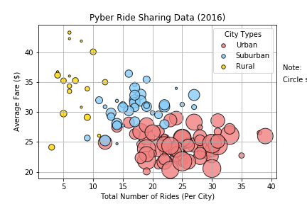
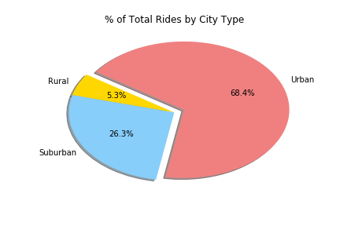
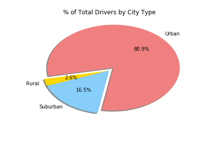

# Matplotlib-Pyber

## Background: Pyber Ridesharing Company

The ride sharing bonanza continues! Seeing the success of notable players like Uber and Lyft, I've decided to join a fledgling ride sharing company of my own. In my latest capacity, I'll be acting as Chief Data Strategist for the company. In this role, I'll be expected to offer data-backed guidance on new opportunities for market differentiation.

I've since been given access to the company's complete recordset of rides. This contains information about every active driver and historic ride, including details like city, driver count, individual fares, and city type.

My objective is to build a [Bubble Plot](https://en.wikipedia.org/wiki/Bubble_chart) that showcases the relationship between four key variables:

* Average Fare ($) Per City
* Total Number of Rides Per City
* Total Number of Drivers Per City
* City Type (Urban, Suburban, Rural)

In addition, I created the following three pie charts:

* % of Total Fares by City Type
* % of Total Rides by City Type
* % of Total Drivers by City Type

## Technologies

* Pandas, Jupyter
* Matplot

## Three Observable Trends Based on The Data

1. According to Bubble Plot of Ride Sharing Data Chart, urban has the most drivers. Rural has the less drivers by checking the small yellow circle size from the data chart.

2. From Pie Chart of Total Rides by City Type, we can easily recognize that people need more rides in urban. The total percentage of urban rides is 68.4%. It is over double than the total percentage of suburban rides plus the total percentage of rural rides.

3. Because of high demands from urban, the average fare is low. However, there are less drivers in rural areas, so the average fare is high. According to percentages of total fares, total rides and total drivers pie charts, suburban is always ranking the second.

```python
%matplotlib inline
# Dependencies and Setup
import matplotlib.pyplot as plt
import pandas as pd
import numpy as np

# File to Load (Remember to change these)
city_data_to_load = "data/city_data.csv"
ride_data_to_load = "data/ride_data.csv"

# Read the City and Ride Data
city_data = pd.read_csv(city_data_to_load )
ride_data = pd.read_csv(ride_data_to_load )

# Combine the data into a single dataset
#merge data
merge_df = pd.merge(ride_data,city_data, on = "city", how = "outer")

# Display the data table for preview
remove_duplicate_city = merge_df.drop_duplicates('city', keep = 'first')
reset_merge_table = remove_duplicate_city.reset_index(drop=True)
reset_merge_table.head()
```
### Bubble Plot of Ride Sharing Data

```python
# Obtain the x and y coordinates for each of the three city types
#group by city names
group_city = merge_df.groupby("city")

#calculate different cities's average fares 
average_fare = group_city["fare"].mean()
#format_average_fare = average_fare.map("${:,.2f}".format)

#calculate different cities's total rides
ride_count = group_city["ride_id"].count()

#get different cities's total driver numbers
driver_data = pd.DataFrame(reset_merge_table)
driver_data = driver_data.set_index("city")
total_driver_count = driver_data["driver_count"]

#get different cities"s types
city_type = driver_data["type"]

#make a dataframe from above data
city_info = pd.DataFrame({"Average Fare per City":average_fare,
                          "Total Rides per City":ride_count,
                          "Total Number of Drivers Per City":total_driver_count,
                          "City Type":city_type
                         })

#seperate cities by city types from city_info
urban = city_info.loc[city_info["City Type"] == "Urban"]
suburban = city_info.loc[city_info["City Type"] == "Suburban"]
rural = city_info.loc[city_info["City Type"] == "Rural"]

#get numbers of different total rides per city by types of cities (x value)
ubran_total_rides = urban["Total Rides per City"]
suburban_total_rides = suburban["Total Rides per City"]
rural_total_rides = rural["Total Rides per City"]

#get numbers of different average fares by types of cities (y value)
ubran_average_fare = urban["Average Fare per City"]
suburban_average_fare = suburban["Average Fare per City"]
rural_average_fare = rural["Average Fare per City"]

#get numbers of different total number of drivers by types of cities (bubble size)
ubran_drivers = urban["Total Number of Drivers Per City"]
suburban_drivers = suburban["Total Number of Drivers Per City"]
rural_drivers = rural["Total Number of Drivers Per City"]

# Build the scatter plots for each city types
ubran_plot = plt.scatter(ubran_total_rides, ubran_average_fare, s=ubran_drivers*10, marker="o", 
                       facecolors="lightcoral",edgecolors="black",  alpha=.8, label="Urban")

suburban_plot=plt.scatter(suburban_total_rides, suburban_average_fare, s=suburban_drivers*10, marker="o", 
                       facecolors="lightskyblue",edgecolors="black",  alpha=.8, label="Suburban")

rural_plot=plt.scatter(rural_total_rides, rural_average_fare, s=rural_drivers*10,marker="o", 
                       facecolors="gold",edgecolors="black", alpha=.8, label="Rural")

# Incorporate the other graph properties
plt.title("Pyber Ride Sharing Data (2016)")
plt.xlabel("Total Number of Rides (Per City)")
plt.ylabel("Average Fare ($)")

plt.ylim(18,45)
plt.xlim(0,42)

plt.grid()
plt.axis('auto')

# Create a legend
leg=plt.legend(title="City Types", scatterpoints=1)
leg.legendHandles[0]._sizes=[30]
leg.legendHandles[1]._sizes=[30]
leg.legendHandles[2]._sizes=[30]

# Incorporate a text label regarding circle size
plt.text(42, 37, "Note:")
plt.text(42, 35 ,"Circle size correlates with driver count per city.")

# Save Figure
plt.savefig("./Bubble Plot of Ride Sharing Data.png")

# Show plot
plt.show()
```


### Total Fares by City Type

```python
# Calculate Type Percents
total_fare = merge_df["fare"].sum()

#seperate cities by city types from origianl merged file(merge_df)
total_urban = merge_df.loc[merge_df["type"] == "Urban"]
total_suburban = merge_df.loc[merge_df["type"] == "Suburban"]
total_rural = merge_df.loc[merge_df["type"] == "Rural"]


total_ubran_fare = total_urban["fare"].sum()
total_sububran_fare = total_suburban["fare"].sum()
total_rural_fare = total_rural["fare"].sum()

ubran_fare_percent = (total_ubran_fare / total_fare)*100
sububran_fare_percent = (total_sububran_fare / total_fare)*100
rural_fare_percent = (total_rural_fare / total_fare)*100

# Build Pie Chart
# Labels for the sections of our pie chart
labels = ["Urban", "Rural","Suburban"]

# The values of each section of the pie chart
sizes = [ubran_fare_percent,rural_fare_percent,sububran_fare_percent]

# The colors of each section of the pie chart
colors = ["lightcoral", "gold","lightskyblue"]

# Tells matplotlib to seperate the "Python" section from the others
explode = (0.1, 0, 0)

plt.title("% of Total Fares by City Type")
plt.pie(sizes, explode=explode, labels=labels, colors=colors,autopct="%1.1f%%", shadow = True,startangle = -100)

# Save Figure
plt.savefig("./Total Fares by City Type.png")

# Show Figure
plt.show()
```


### Total Rides by City Type

```python
# Calculate rides Percents
total_rides = len(merge_df["ride_id"])

total_ubran_rides = len(total_urban["ride_id"])
total_sububran_rides = len(total_suburban["ride_id"])
total_rural_rides = len(total_rural["ride_id"])

ubran_rides_percent = (total_ubran_rides / total_rides)*100
sububran_rides_percent = (total_sububran_rides / total_rides)*100
rural_rides_percent = (total_rural_rides / total_rides)*100

# Build Pie Chart
# Labels for the sections of our pie chart
labels = ["Urban", "Rural","Suburban"]

# The values of each section of the pie chart
sizes = [ubran_rides_percent,rural_rides_percent,sububran_rides_percent]

# The colors of each section of the pie chart
colors = ["lightcoral", "gold","lightskyblue"]

# Tells matplotlib to seperate the "Python" section from the others
explode = (0.1, 0, 0)

plt.title("% of Total Rides by City Type")
plt.pie(sizes, explode=explode, labels=labels, colors=colors,autopct="%1.1f%%", shadow = True,startangle = -100)

# Save Figure
plt.savefig("./Total Rides by City Type.png")

# Show Figure
plt.show()
```


### Total Drivers by City Type

```python
# Calculate Driver Percents
ubran_driver_percent = (ubran_drivers.sum() / total_driver_count.sum())*100
sububran_driver_percent = (suburban_drivers.sum()  / total_driver_count.sum())*100
rural_driver_percent = (rural_drivers.sum() / total_driver_count.sum())*100

# Build Pie Chart
# Labels for the sections of our pie chart
labels = ["Urban", "Rural","Suburban"]

# The values of each section of the pie chart
sizes = [ubran_driver_percent,rural_driver_percent,sububran_driver_percent]

# The colors of each section of the pie chart
colors = ["lightcoral", "gold","lightskyblue"]

# Tells matplotlib to seperate the "Python" section from the others
explode = (0.1, 0, 0)

plt.title("% of Total Drivers by City Type")
plt.pie(sizes, explode=explode, labels=labels, colors=colors,autopct="%1.1f%%", shadow = True,startangle = -100)


# Save Figure
plt.savefig("./Total Drivers by City Type.png")

# Show Figure
plt.show()
```


